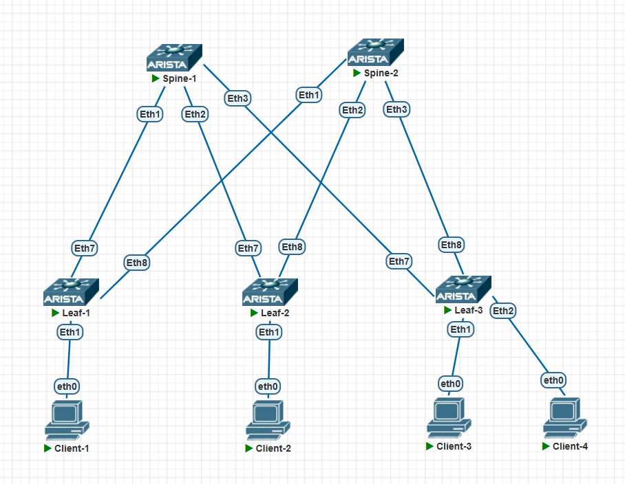

## Домашнее задание 1

### Цели

- Собрать схему CLOS

- Распределить адресное пространство

### Схема сети

|Device|Interface|IP|Description|
|-|-|-|-|
|Spine-1|Loopback0|10.0.0.0/32|Underlay loopback|
|       |Loopback1|10.0.1.0/32||
|       |Ethernet1|10.0.128.0/31|P-t-p to Leaf1|
|       |Ethernet2|10.0.128.2/31|P-t-p to Leaf2|
|       |Ethernet3|10.0.128.4/31|P-t-p to Leaf3|
|Spine-2|Loopback0|10.0.0.1/32|Underlay loopback|
|       |Loopback1|10.0.1.1/32||
|       |Ethernet1|10.0.132.0/31|P-t-p to Leaf1|
|       |Ethernet2|10.0.132.2/31|P-t-p to Leaf2|
|       |Ethernet3|10.0.132.4/31|P-t-p to Leaf3|

### Распределение адресного пространство

Перед планированием распределения адресного пространства для underlay-сети ЦОД, определим исходные условия и ограничения:

- в каждом ЦОД используется двухуровневая архитерктура Spine/Leaf, без уровня Superspine

- для расчета необходимых размеров адресных блоков, в качестве реперной точки, будем ориентироваться на применение фиксированных коммутаторов семейства Cisco Nexus 9300 с максимальной, на данный момент, портовой ёмкостью (при использовании оборудования с меньшим числов портов, расчеты останутся актуальными):

  - Cisco Nexus N9364E-SG2-Q, 64 порта 800G - Spine 

  - Cisco Nexus 9364C-H1, 64 порта 100G - Leaf, 

- **максимальное количество Spine в ЦОД составляет 32**, исходя из задействования половины (64 / 2 = 32) портов Leaf, каждый из которых соединён с отдельным Spine, что даёт для Leaf наилучшее отношение переподписки 1:1

- **максимальное число Leaf в ЦОД составляет 512**, исходя из занятия всех портов Spine, работающих в режиме 8x100G breakout (64 x 8 = 512)

- на каждом Spine и Leaf необходимы два loopback-интерфейса с адресами /32

- для p-t-p соединения Leaf-Spine используются блоки /31 (для одного ЦОД, максимальное число соединений составляет 32 x 512 = 16 384, а IP-адресов 16 384 x 2 = 32 768)

Таким образом, для размещения перечисленных адресов, потребуются блоки:

- **/27** - Spine, Loopback0
- **/27** - Spine, Loopback1
- **/23** - Leaf, Loopback0
- **/23** - Leaf, Loopback1
- **/17** - соединения Leaf - Spine

При суммировании, минимально достаточным является блок **/16**.

Внутренее адресное пространство IPv4 для отдельных ЦОД-ов выделяется блоками **10.[N-1].0.0/16**, из приватного блока **10.0.0.0/8** (*RFC1918*),
что допускает адресацию **до 256 ЦОД**:

- **10.0.0.0/16** - ЦОД 1
- **10.1.0.0/16** - ЦОД 2
- **...**
- **10.255.0.0/16** - ЦОД 256

В блоке **/16** каждого ЦОД, выделяются субблоки:

- **10.[N-1].0.0/27** - Spine, Loopback0
- **10.[N-1].1.0/27** - Spine, Loopback1
- **10.[N-1].4.0/23** - Leaf, Loopback0
- **10.[N-1].6.0/23** - Leaf, Loopback1
- **10.[N-1].128.0/17** - соединения Leaf - Spine

*Два блока **/27** для loopback-интерфейсов Spine возможно разместить в одном блоке **/26**, но, выравнивание на границу **/24**,
за счет чего, значения младшего октета для адресов одного устройства совпадают, более наглядно.*

Интерфейсам коммутаторов назначаются адреса:

- **10.[N-1].0.[S-1]/32** - Spine-S, Loopback0
- **10.[N-1].1.[S-1]/32** - Spine-S, Loopback1
- **10.[N-1].[4 + (L-1) div 256].[(L-1) mod 256]/32** - Leaf-L, Loopback0
- **10.[N-1].[6 + (L-1) div 256].[(L-1) mod 256]/32** - Leaf-L, Loopback1
- **10.[N-1].[128 + 4 * (S-1) + (L-1) div 128].[2 * (L-1) mod 128]/31** - Spine-S соединение с Leaf-L
- **10.[N-1].[128 + 4 * (S-1) + (L-1) div 128].[2 * (L-1) mod 128 + 1]/31** - Leaf-L соединение с Spine-S

где:

- **N** - номер ЦОД в диапазоне [1-256]
- **S** - номер Spine в диапазоне [1-32]
- **L** - номер Leaf  в диапазоне [1-512]

Помимо блоков, используемых для адресации underlay-сети, в адресном пространстве **/16** каждого ЦОД-а, остаются свободные адреса:

- **10.[N-1].2.0/23**
- **10.[N-1].8.0/21**
- **10.[N-1].16.0/20**
- **10.[N-1].32.0/19**
- **10.[N-1].64.0/18**

*В файле [IP calc.xlsx](https://github.com/IronWhale11/Otus-DC-networks-design/blob/main/labs/lab01/IP%20calc.xlsx) находится калькулятор для заполнения массивов адресов.*
